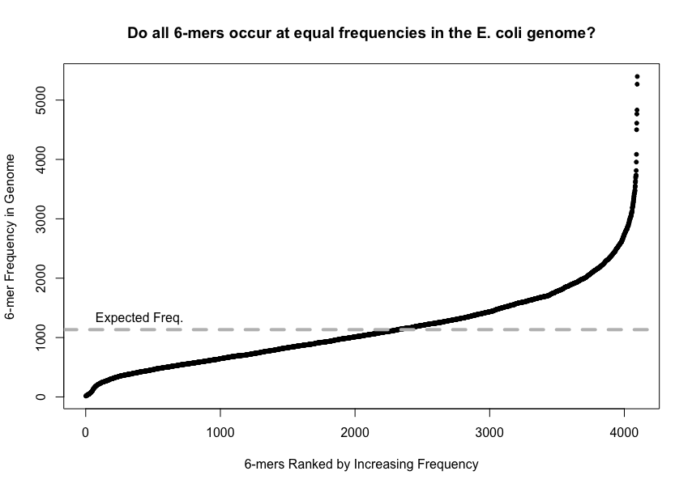
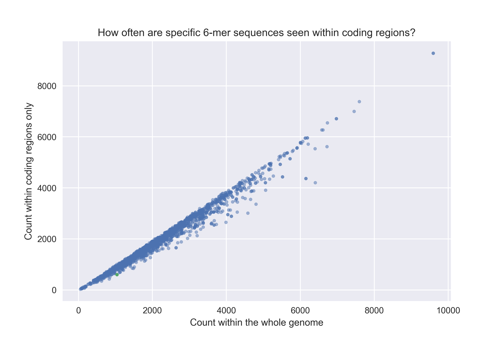

# most-kmers

Finds the frequency of all 6-mers sequences inside the genome of E. coli thorugh a hash table.

It is expected that there will be some very high frequency 6-mers since viral DNA and transposons can be incorperated into the genome. I'm unsure of what the very low 6-mers are or why the line still slopes upward slightly. A future test may include forward and backwards concensus sequences since the transposons could clearly be backwards. Also, since the genome is circular, really a couple more sequences should be added that span the that single break.

Altogether though, I'm pretty suprised that the result was that clear. The final plot is [6-mers.png](6-mers.png), and the main code is [rank-kmers.py](rank-kmers.py).

A similar anaylsis of 6-mers also within E. coli. Sees the correlation between how often a 6-mer is seen throughout the genome versus within coding readings.

Ideally since about 90% of the genome is coding, all sequences should lie along a line with slope 0.9 though the origin. It's pretty clear though that a lot of sequnces are below this line. They might be cis-binding regions that would be block the RNAP during transcription, and therefore, there should be less of them. Also around (1000, 750), the green data point corresonds to 'TATAAT', the TATA box. It too is seen at a low frequency in coding regions.

Pretty expected result. The final plot is [kmers_in_genes.png](kmers_in_genes.png), and the main code is [6-mers.ipynb](6-mers.ipynb).

